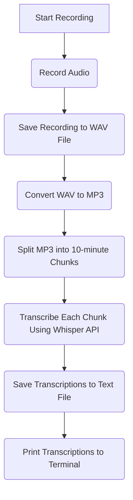

# Voice Transcriber Using OpenAI's Whisper API

[](LICENSE)

This Python script is a tool for recording your voice and transcribing it using OpenAI's Whisper API. The tool records audio in 10-minute chunks and saves the recordings to an MP3 file with a timestamp. The tool then transcribes each chunk using the Whisper API and saves the transcriptions to a text file with a timestamp. Finally, the tool prints the transcriptions to the terminal.



## Requirements

- Python 3.6 or higher
- PyAudio
- wave
- pydub
- openai

## Installation

1.  Clone the repository:

    ```bash
    git clone https://github.com/icereed/openai-whisper-voice-transcriber.git
    ```

2.  Install the required packages:

    `pip install pyaudio wave pydub openai`

3.  Get the OpenAI API key from [https://platform.openai.com/account/api-keys](https://platform.openai.com/account/api-keys)

4.  Set your OpenAI API key as an environment variable:

    ```bash
    export OPENAI_API_KEY=yourapikey
    ```

    Alternatively, you can replace `os.environ.get("OPENAI_API_KEY")` with your actual API key in the script.

## Usage

1.  Run the script:

    `python audio_recorder.py`

2.  Press `Ctrl+C` to stop recording.
3.  The script will save the recorded audio to an MP3 file and split it into 10-minute chunks.
4.  The script will transcribe each chunk using the Whisper API and save the transcriptions to a text file.
5.  The script will print the transcriptions to the terminal.

## Customization

You can customize the following constants in the script:

- `CHUNK`: the number of audio samples per frame
- `FORMAT`: the audio format
- `CHANNELS`: the number of audio channels (mono or stereo)
- `RATE`: the audio sample rate
- `MAX_RETRIES`: the maximum number of retries for failed transcriptions
- `RETRY_DELAY`: the delay in seconds between retries
- `OUTPUT_INTERVAL`: the output interval in seconds for total length of recording

## Troubleshooting

### ffmpeg not found

If you encounter errors regarding ffmpeg not being found, you can install ffmpeg using Homebrew:

```bash
brew install ffmpeg
```

### Running on M1 Macs: Installing PyAudio on M1 Macs

If you encounter issues when installing PyAudio on an M1 Mac, you can follow the steps below to troubleshoot the issue:

1.  Install `portaudio` using Homebrew:

    `brew install portaudio`

2.  Link `portaudio` using Homebrew:

    ```bash
    brew link portaudio
    ```

3.  Copy the path where `portaudio` was installed. You can get this by running:

    ```bash
    brew --prefix portaudio
    ```

4.  Create a `.pydistutils.cfg` file in your home directory:

    ```bash
    sudo nano $HOME/.pydistutils.cfg
    ```

5.  Paste the following content into the file:

    ```
    [build_ext]
    include_dirs=<PATH FROM STEP 3>/include/
    library_dirs=<PATH FROM STEP 3>/lib/
    ```

    Replace `<PATH FROM STEP 3>` with the path you copied in step 3.

6.  Install `pyaudio` using `pip`:

    `pip install pyaudio`

These steps should help you install PyAudio on an M1 Mac. If you encounter any issues, please check the PyAudio documentation or seek help from the PyAudio community.

## License

This project is licensed under the AGPL 3.0 license. See the [LICENSE](LICENSE) file for details.
